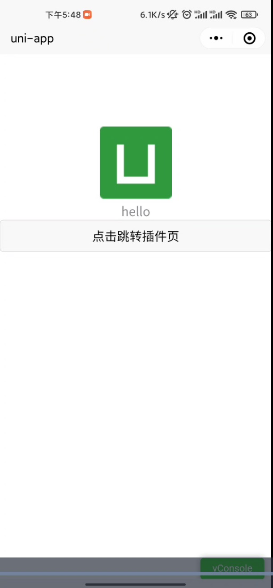

# uniapp + vue2 开发微信小程序插件

`uniapp` 插件打包当前还不支持 `vue 3`，[参考文档 https://ask.dcloud.net.cn/article/39290](https://ask.dcloud.net.cn/article/39290)



## Project setup
```
npm install
```

### 开发
```
// 自行补充 src/manifest.json/mp-weixin/plugins/myPlugin/provider 当前开发小程序 appId
// 需要同时运行两个命令：
npm run dev:mp-weixin
npm run dev:wxplugin

// 然后用小程序开发者工具打开本项目根目录即可预览
```

### 打包
```
// 依次运行
npm run build:mp-weixin
npm run build:wxplugin
```

### 问题

1. 组件的 .sync 在插件页面中更新无效
